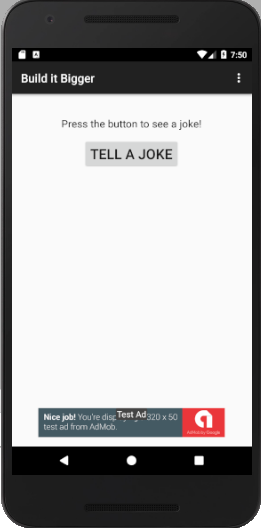

# Build It Bigger
### The Goal
The goal of this project is to show the use of Gradle to build a joke-telling app. The design factoring libraries functionality using paid and free version. Each version of the app modularize by flavors build. The app also utilize the use of Google Cloud Endpoints as a jokes server.

### Starter Code

This project use this repository as [starter code](https://github.com/udacity/ud867/tree/master/FinalProject).

### Required Components
- Project contains a Java library for supplying jokes
- Project contains an Android library with an activity that displays jokes passed to it as intent extras.
- Project contains a Google Cloud Endpoints module that supplies jokes from the Java library.
- Project loads jokes from GCE module via an async task.
- Project contains connected tests to verify that the async task is indeed loading jokes.
- Project contains paid/free flavors. The paid flavor has no ads, and no unnecessary dependencies.

### Required Behavior
App retrieves jokes from Google Cloud Endpoints module and displays them via an Activity from the Android Library.

### Screenshot

